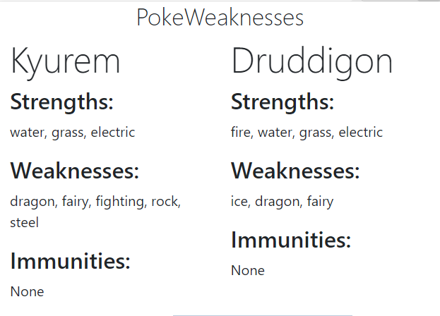

# PokeWeaknesses
PokeWeaknesses is a Chrome extension addon for Pokemon Showdown that takes in the pokemon's names that are currently in battle and displays which types are effective/not effective for each pokemon.

## Installation
Download these files as a zip file and unzip the files. Then go to your extensions page, click Load Unpacked, and select the unzipped folder. The extension should be added.

## Usage

When you enter a battle in Pokemon Showdown, just click the extension icon at the top right and you will see the type information for each pokemon in battle.

## TODO
- When getting the request from the PokeAPI, using the name of the pokemon fails sometimes because the pokemon is named differently for the endpoint URL (ex. Giratina is accessed through https://pokeapi.co/api/v2/pokemon/giratina-altered, not https://pokeapi.co/api/v2/pokemon/giratina).
- Add pictures of the pokemon in the popup window
- Include a general search bar for pokemon not in the battle